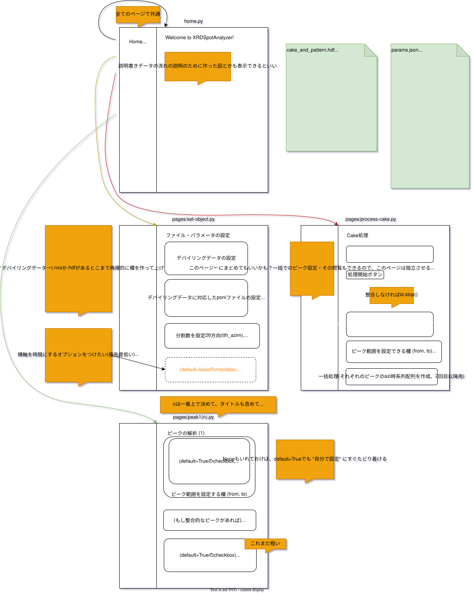

# XRD Spot Analyzer

## 概要

時系列XRDデータのピークを分析するアプリです。

## 起動方法

- AppManagerから起動する
    - AppManagerと同じ階層にcloneしてください
    - 起動方法は[AppManager](https://github.com/ishizawa2468/AppManagerForStreamlit?tab=readme-ov-file#%E6%A6%82%E8%A6%81)で確認してください
- ターミナルから起動する場合
    - どちらかのコマンドを実行してください
    - `python main.py`
    - `streamlit run home.py`

## デモ

一時停止などしたい場合はdocsにあるdemo.mp4をダウンロードしてください。

## 画面・ファイル構成

## 備考

